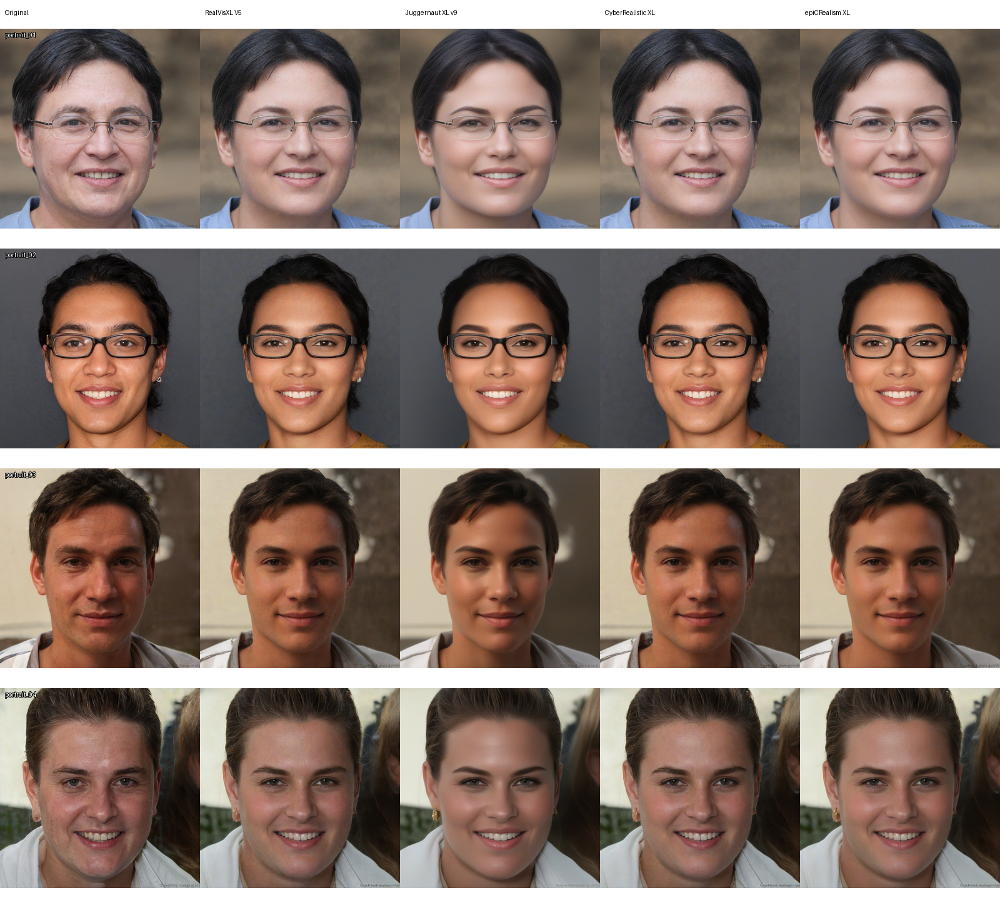

# AgentFace Experiment 1: Pluggable Beautification Models

[中文实验报告](reports/实验一_美颜模型可插拔性验证.md)

This repository records an offline validation of AgentFace's interchangeable
beautification-model position. It uses one fixed SDXL Img2Img procedure and
only changes the plugged-in model. It does **not** claim that one model is
universally better than another.

## What is included

- Four public demo portraits in `samples/`
- Sixteen generated results in `outputs/portrait_01/` through
  `outputs/portrait_04/`
- Five comparison sheets in `outputs/comparisons/`, including
  `experiment_1_overview.png`
- The fixed experiment contract in `config/experiment_1.json`
- A SHA-256 manifest for the inputs and sixteen generated images in
  `runs/experiment_1_manifest.json`
- The unified offline runner in `code/run_model_swap.py`

The repository intentionally excludes model checkpoints and any original
laboratory service code. Obtain checkpoints from their respective upstream
publishers and comply with each model's licence and terms before reproducing
the run.

## Result overview



## Fixed experiment contract

| Item | Value |
| --- | --- |
| Inputs | `portrait_01.jpg` to `portrait_04.jpg` |
| Resolution | 1024 x 1024 |
| Inference steps | 20 |
| Guidance scale | 5.0 |
| Denoising strength | 0.25 |
| Random seed | 42 |

The prompt and negative prompt are recorded verbatim in
`config/experiment_1.json`.

## Reproduce

1. Create a `models/` directory matching the paths in
   `config/experiment_1.json` and supply the four checkpoints:
   RealVisXL V5, Juggernaut XL v9, CyberRealistic XL, and epiCRealism XL.
   Checkpoints are not distributed here.
2. Install the dependencies:

   ```bash
   pip install -r requirements-offline.txt
   ```

3. Verify local files before inference:

   ```bash
   python code/run_model_swap.py --check
   ```

4. Run all four models, or select one model with repeated `--model` flags:

   ```bash
   python code/run_model_swap.py
   ```

On a shared or memory-constrained GPU, set `SDXL_CPU_OFFLOAD=1`. This changes
memory placement only; it does not change the fixed image-generation settings.

## Scope

The runner is deliberately offline. It does not start the AgentFace web UI,
FastAPI service, or database. The evidence is the sixteen images, the five
comparison sheets, and the manifest included here.

The upstream AgentFace project is available at
<https://github.com/GDUE-DVL/AgentFace>.
