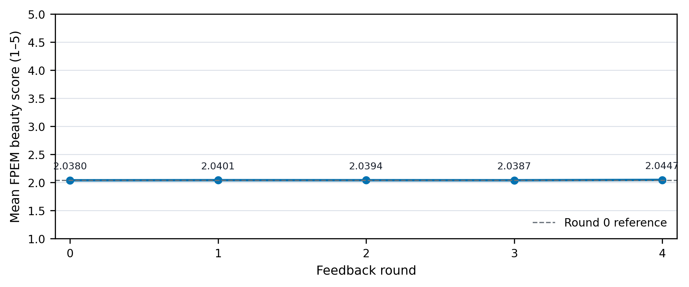
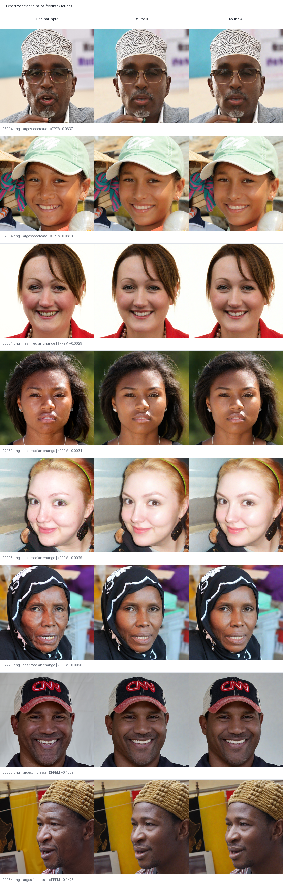

# 补充实验二：反馈闭环优化实验

## 实验目的

固定美颜模型 RealVisXL V5，验证 AgentFace 是否能完成“生成—评分—反馈—参数更新”的闭环，并观察经过 5 轮后自动评分是否发生变化。

## 本报告使用的数据范围

本报告**只**使用正式运行 `official_continuous` 的结果。早期的 `smoke`、`official`、`official_stable` 文件夹是准备阶段的诊断记录：其中曾发现评分权重前缀加载和提示词档位过粗的问题，已修正，因此这些试跑数据和图片不参与下述统计或结论。

## 实验设置

- 输入：100 张已选定的人脸样本，来自 `data/inputs/`；同一批图片在 5 轮中保持不变。
- 固定模型：`RealVisXL_V5`。
- 固定生成条件：1024×1024、20 步、guidance scale 5.0、img2img strength 0.25、随机种子 42、基础提示词和负向提示词固定。
- 可更新项：皮肤平滑、皮肤提亮、瑕疵修复三项美颜强度；其余美颜参数固定。连续强度值直接写入提示词，避免“小幅更新但提示词完全相同”。
- 评分：FPEM 自动评分模型。它输出连续的 1–5 分；同时按 `star = clamp(floor(score + 0.5), 1, 5)` 显示为星级和简单反馈。
- 更新方式：100 张图片作为一个批次，分别比较每个参数的较高/较低候选的平均 FPEM 分，再做一次有边界的小步更新。这样避免把原有的单张会话更新连续执行 100 次而导致参数失控。
- 执行方式：直接运行离线推理脚本，没有启动网页、FastAPI 或数据库服务。

## 每轮流程

```text
100 张输入图
  → 使用当前美颜参数生成 100 张图
  → FPEM 对 100 张结果评分
  → 汇总评分反馈，受限地更新 3 个美颜参数
  → 进入下一轮
```

共运行 5 轮（第 0 至第 4 轮），得到 500 张结果图。

## 完整性核验

- 每一轮均有 100 张图片和 100 条评分，合计 500 张 1024×1024 PNG。
- 五轮 FPEM 均严格加载：`missing_keys=[]`、`unexpected_keys=[]`。
- 同一批验证图片重复评分结果完全一致。
- 第 0 到第 1 轮的 100/100 张同名输出文件哈希均发生变化，说明参数更新确实改变了后续模型输入与生成结果。

## 结果



**图 1：** 单个固定随机种子的 5 轮平均 FPEM 评分。纵轴保留 1–5 的完整量程；因此可以直观看到本次提升幅度很小，而非显著跃升。

| 轮次 | 平均 FPEM 分 | 平均星级 | 皮肤平滑（更新后） | 提亮（更新后） | 瑕疵修复（更新后） |
| --- | ---: | ---: | ---: | ---: | ---: |
| 0 | 2.038012 | 2.19 | 1.9113 | 0.9028 | 2.9000 |
| 1 | 2.040055 | 2.19 | 1.8254 | 0.8051 | 2.8000 |
| 2 | 2.039436 | 2.19 | 1.7374 | 0.7083 | 2.7000 |
| 3 | 2.038741 | 2.19 | 1.6507 | 0.6114 | 2.6000 |
| 4 | 2.044714 | 2.19 | 1.5756 | 0.5153 | 2.5000 |

- 第 0 轮平均 FPEM 分：**2.038012**。
- 第 4 轮平均 FPEM 分：**2.044714**。
- 第 0→4 轮平均变化：**+0.006702**（相对 +0.329%）。
- 逐图配对结果：**63** 张上升，**37** 张下降，**0** 张相同。
- 四舍五入后的平均星级均为 2.19；这说明星级显示太粗，不能反映这次 0.0067 量级的细微变化，正式分析以连续 FPEM 分数为准。



**图 2：** 原图、第 0 轮和第 4 轮的代表样本。样本不是只挑上升图片：选择规则为 FPEM 降幅最大的 2 张、最接近中位变化的 4 张、增幅最大的 2 张。

- `03914.png`：largest decrease，第 0→4 轮 FPEM 变化 -0.063719
- `02154.png`：largest decrease，第 0→4 轮 FPEM 变化 -0.061284
- `00081.png`：near median change，第 0→4 轮 FPEM 变化 +0.002944
- `02169.png`：near median change，第 0→4 轮 FPEM 变化 +0.003148
- `00006.png`：near median change，第 0→4 轮 FPEM 变化 +0.002871
- `02728.png`：near median change，第 0→4 轮 FPEM 变化 +0.002578
- `00606.png`：largest increase，第 0→4 轮 FPEM 变化 +0.168939
- `01084.png`：largest increase，第 0→4 轮 FPEM 变化 +0.142591

## 结论

在本次单随机种子、同一批 100 张图片参与反馈与评估的运行中，AgentFace 完成了评分反馈、参数更新和下一轮再生成的完整闭环。固定 RealVisXL V5 后，第 4 轮的平均 FPEM 分数比第 0 轮高 **0.006702**，且 63/100 张图片的自动评分提高。因此，本实验支持下面这个**限定性结论**：

> 在 FPEM 自动评分器下，AgentFace 的反馈闭环可以更新美颜参数，并在本次运行中带来很小的正向平均评分变化。

这个结论不能扩大为“所有人像质量都明显提升”或“视觉效果一定更好”：本实验只有一个随机种子、没有独立留出的 20 张验证集、评分器只有 FPEM，也没有人类主观评分或专门的人脸变形检测。若要把结论做得更强，下一步应使用 80 张反馈更新、20 张只做最终验证，并增加人工自然度评分。

## 可复现文件

- 配置：[config/experiment_2.json](../config/experiment_2.json)
- 统一运行脚本：[code/run_feedback_loop.py](../code/run_feedback_loop.py)
- 逐轮汇总：[experiment_2_round_summary.csv](experiment_2_round_summary.csv)
- 结果清单：[runs/experiment_2_manifest.json](../runs/experiment_2_manifest.json)
- 第 0 至第 4 轮的逐图评分：`../scores/official_continuous/round_00.json` 至 `round_04.json`

生成时间（UTC）：2026-09-21T16:23:24.325663+00:00
